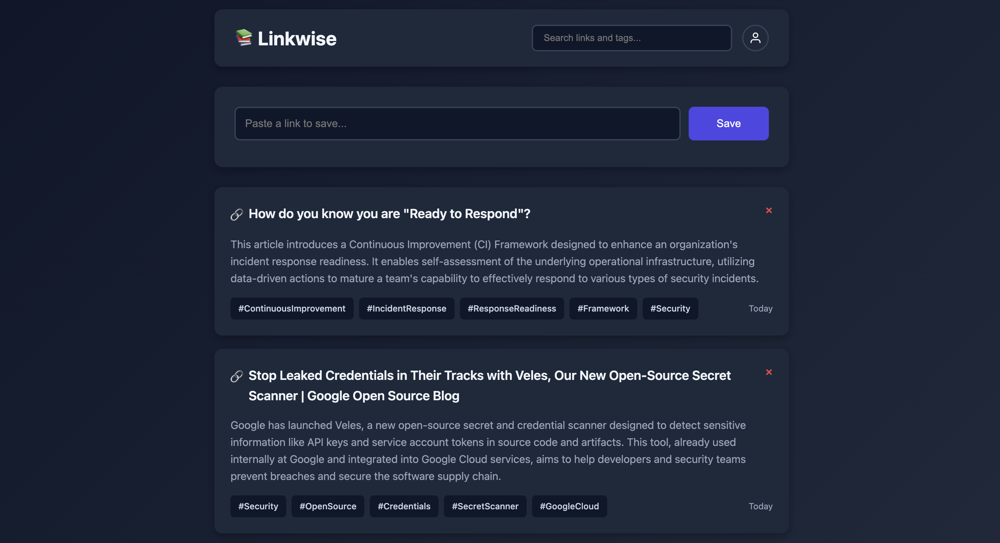

# Linkwise - Personal Link Aggregator

A minimalist web app to save and categorize web links with automatic article summarization and tag generation using AI.



**This version uses:**
- ✅ **SQLite** for database (no external DB service needed)
- ✅ **Flask-Login** for authentication (no Firebase/Supabase)
- ✅ **Session-based auth** (simple cookies)
- ✅ **Single container** deployment

## Features

- 🔐 Built-in email/password authentication (sign-up closes after the first account by default)
- 📝 Automatic article content extraction
- 🤖 AI-powered summaries and tags using the Gemini API
- 🔍 Real-time search and filtering
- 📱 Responsive design
- 🚀 Deploy anywhere that runs a container (Railway, Cloud Run, Render, Fly.io, etc.)

## Tech Stack

**Frontend:**
- HTML, CSS, JavaScript (Vanilla)

**Backend:**
- Python Flask + Gunicorn
- Flask-Login (session-based auth)
- SQLite (embedded database)
- BeautifulSoup4 (article parsing)
- Google Gemini API (AI summaries, default model `gemini-3.8-flash`)

## Configuration

| Variable | Required | Default | Description |
|---|---|---|---|
| `GEMINI_API_KEY` | Yes | — | API key from [Google AI Studio](https://aistudio.google.com/api-keys) |
| `SECRET_KEY` | Yes | — | Session signing key. Generate with `openssl rand -hex 32` |
| `GEMINI_MODEL` | No | `gemini-3.8-flash` | Gemini model used for summaries and tags |
| `ALLOW_SIGNUP` | No | `false` | The first account can always be created. Set to `true` to let more people sign up |
| `DB_PATH` | No | `linkwise.db` (`/app/data/linkwise.db` in Docker) | SQLite database file |
| `PORT` | No | `8080` | Port to listen on |

## Quick Start (Local Development)

1. **Clone the repository**

2. **Install dependencies:**
   ```bash
   pip install -r requirements.txt
   ```

3. **Configure environment:**
   ```bash
   cp .env.example .env
   # then set GEMINI_API_KEY and SECRET_KEY in .env
   ```

4. **Run the app:**
   ```bash
   python app.py
   ```

5. **Access at:** `http://localhost:8080` and create your account.

The SQLite database (`linkwise.db`) is created automatically on first run.

> Session cookies are marked `Secure`. Chrome and Firefox accept them on `http://localhost`; Safari doesn't, so use HTTPS (e.g. a Codespaces forwarded URL) if sign-in doesn't stick.

## Docker

```bash
docker build -t linkwise .
docker run -p 8080:8080 \
  -e GEMINI_API_KEY=your-gemini-api-key \
  -e SECRET_KEY=$(openssl rand -hex 32) \
  -v linkwise-data:/app/data \
  linkwise
```

The container runs as a non-root user and stores the database in `/app/data`. Mount a volume there to keep your links across redeploys.

**Railway:** attach a volume at `/app/data`. Railway mounts volumes as root, so also set `RAILWAY_RUN_UID=0` or the app won't be able to write to it.

## Security Notes

- Link fetching only reaches public addresses. Private, loopback, link-local and cloud metadata IPs are blocked, including via redirects and DNS rebinding.
- Only HTML pages are fetched, capped at 2 MB and 20 seconds.
- Cross-site write requests are rejected, and pages are served with a strict Content Security Policy.
- There is no login rate limiting, so keep `ALLOW_SIGNUP=false` on public deployments and use a strong password.
